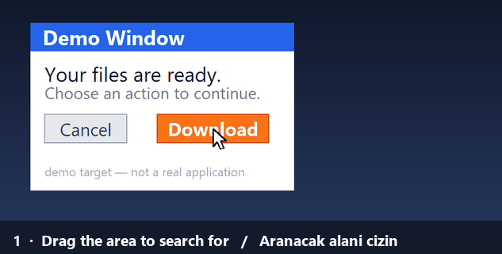

# Auto Clicker / Otomatik Tıklayıcı



Mouse and keyboard automation for Windows. It clicks the points you pick, in the
order and with the delays you set, sends keystrokes and types text — and it can
find its target **by searching for an image on screen** instead of using fixed
coordinates.

Interface available in **English and Turkish** (Dil / Language menu).

**No installation, no dependencies.** No third-party Python packages are used:
mouse and keyboard input go through the Windows `SendInput` API, screen capture
through GDI, and PNG encoding/decoding through `zlib` — all via `ctypes` and the
standard library.

*(Türkçe: [README.md](README.md) · [KULLANIM.md](KULLANIM.md))*

## Download

Grab the build for your CPU from the [latest release](../../releases/latest):

| File | For |
|---|---|
| `Otomatik Tiklayici (x64).exe` | Intel / AMD Windows *(most machines)* |
| `Otomatik Tiklayici (ARM64).exe` | Snapdragon / ARM Windows |

A single file — just double-click it. It writes its settings and captured
images next to itself.

> Windows SmartScreen may warn about an "unknown publisher" the first time
> (normal for an unsigned executable): **More info → Run anyway**.

## What it does

- **Ordered step list** — left/right/middle/double click, move mouse, hold and
  release, scroll wheel, key combinations (`ctrl+shift+s`), typing text, waiting.
  Each step has its own repeat count and delay afterwards.
- **Loop count** — how many times the list repeats; enter `0` to loop endlessly
  until you stop it.
- **Image targeting** — the screen dims, you drag a box around what to look for,
  then mark **the point to click**. While running it searches for that box on
  screen and clicks the point you marked, even if the window has moved.
- **Condition (IF)** — "if this is on screen, do that". A step searches for an
  image and writes the result into one of `if1`…`if6`; later steps are bound to
  a slot with `if if1 is active` / `if if1 is inactive`.
- **Wait For Image** — waits until a window or button appears, without clicking.
- **System-wide hotkeys**, working even when the window is in the background:
  `F6` start/stop · `F7` capture position · `F8` or `Ctrl+T` stop ·
  `F9` pause · **hold ESC while running for an emergency stop**.
- **Human-like jitter** — optional ±pixels on the click point and ±percent on
  the delays.
- Lists are saved as `.json`; the last list is restored on startup.

## Running from source

Windows and Python 3.8+ are all you need:

```
python otomatik_tiklayici.py
```

### Building the executable

```
python -m pip install pyinstaller
python exe_yap.py
```

The executable inherits the architecture of the Python that builds it, and that
architecture goes into the file name (`Otomatik Tiklayici (x64).exe`). Run it
once with a Python of each architecture to produce both builds.

## Files

| File | Contents |
|---|---|
| `otomatik_tiklayici.py` | Tkinter UI, region/point picker, application flow |
| `motor.py` | Step engine, condition logic |
| `winput.py` | Windows mouse/keyboard input layer (`SendInput`) |
| `ekran.py` | Screen capture (GDI), PNG read/write, template search |
| `kisayol.py` | System-wide hotkeys (`RegisterHotKey`) |
| `diller.py` | Interface strings (Turkish / English) |
| `exe_yap.py` | Builds the executable with PyInstaller |
| `gif_yap.py` | Records the demo GIF above by driving the real app |

## How it works

**Image search** runs without any image-processing library: the screen is
captured into a raw BGRA buffer with GDI `BitBlt`, the most distinctive
horizontal run of pixels in the template is scanned for inside that buffer with
`bytes.find`, and candidate positions are then verified row by row. On a
6720×2167 virtual desktop, capture takes ~180 ms and a full-screen search
~170 ms.

**Coordinates are physical pixels.** Per-monitor DPI awareness is enabled at
startup so points do not drift at 125%/150% scaling. Column widths and row
heights in the UI are derived from the actual font metrics of the display.

## Limitations

- **Windows only.**
- Sending input to windows running as administrator (e.g. Task Manager)
  requires running this program as administrator too.
- Coordinates depend on screen resolution; if the resolution or scaling changes
  you need to capture the points again. Image targeting is more robust, but the
  template must have been captured at the same scale.
- While the program is open, `Ctrl+T` is reserved system-wide, so it will not
  open a new browser tab during that time.
