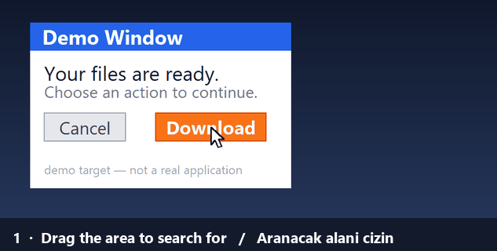

# Auto Clicker / Otomatik Tıklayıcı



Mouse and keyboard automation for Windows. It clicks the points you pick, in the
order and with the delays you set, sends keystrokes and types text — and it can
find its target **by searching for an image on screen** instead of using fixed
coordinates. The interface is available in **English and Turkish**
(*Dil / Language* menu).

**[English](#english) · [Türkçe](#türkçe)**

---

## English

**No installation, no dependencies.** The application uses no third-party Python
packages: mouse and keyboard input go through the Windows `SendInput` API, screen
capture through GDI, and PNG encoding/decoding through `zlib` — all via `ctypes`
and the standard library.

### Download

Grab the build for your CPU from the [latest release](../../releases/latest):

| Release file | For |
|---|---|
| `Otomatik.Tiklayici.x64.exe` | Intel / AMD Windows *(most machines)* |
| `Otomatik.Tiklayici.ARM64.exe` | Snapdragon / ARM Windows |

The same builds are also in the repository root as
`Otomatik Tiklayici (x64).exe` and `Otomatik Tiklayici (ARM64).exe`.

A single file — just double-click it. It writes its settings (`ayarlar.json`) and
captured images (`goruntuler/`) next to itself; take the `goruntuler` folder along
when you move the executable to another computer.

> Windows SmartScreen may warn about an "unknown publisher" the first time
> (normal for an unsigned executable): **More info → Run anyway**.

### Features

- **Ordered step list** — left/right/middle/double click, move mouse, hold and
  release, scroll wheel, key combinations (`ctrl+shift+s`), typing text, waiting.
  Each step has its own repeat count and delay afterwards.
- **Loop count** — how many times the list repeats; enter `0` to loop endlessly
  until you stop it.
- **Image targeting** — the screen dims, you drag a box around what to look for,
  then mark **the point to click**. While running it searches for that box on
  screen and clicks the point you marked, even if the window has moved.
- **Condition** — "run this step only if that text is on screen". Each step can
  carry an optional *condition image*: the step runs when that area is on screen
  (or when it is not) and is skipped otherwise. The condition area is only
  searched, never clicked; what the step clicks stays separate.
- **Wait For Image** — waits until a window or button appears, without clicking.
- **System-wide hotkeys**, working even when the window is in the background:
  `F6` start/stop · `F7` capture position · `F8` or `Ctrl+T` stop ·
  `F9` pause · **hold ESC while running for an emergency stop**.
- **Human-like jitter** — optional ±pixels on the click point and ±percent on
  the delays.
- Lists are saved as `.json`; the last list is restored on startup. Lists are
  language-independent, so a list saved in one interface language opens in the
  other.

A detailed user guide (in Turkish) is in **[KULLANIM.md](KULLANIM.md)**.

### Running from source

Windows and Python 3.8+ are all you need:

```
python otomatik_tiklayici.py
```

`Otomatik Tiklayici.bat` does the same (it prefers `pythonw.exe`, so no console
window opens).

### Building the executable

```
python -m pip install pyinstaller
python exe_yap.py
```

`exe_yap.py` produces a single-file, windowed executable in the project folder.
The executable inherits the architecture of the Python that builds it, and that
architecture goes into the file name (`Otomatik Tiklayici (x64).exe`). Run it once
with a Python of each architecture to produce both builds, for example:

```
py -3.11        exe_yap.py     ->  Otomatik Tiklayici (x64).exe
py -3.14-arm64  exe_yap.py     ->  Otomatik Tiklayici (ARM64).exe
```

The executable must not be running while it is rebuilt.

### Files

| File | Contents |
|---|---|
| `otomatik_tiklayici.py` | Tkinter UI, region/point picker, application flow |
| `motor.py` | Step engine, condition logic |
| `winput.py` | Windows mouse/keyboard input layer (`SendInput`) |
| `ekran.py` | Screen capture (GDI), PNG read/write, template search |
| `kisayol.py` | System-wide hotkeys (`RegisterHotKey`) |
| `diller.py` | Interface strings (Turkish / English) |
| `exe_yap.py` | Builds the executable with PyInstaller |
| `gif_yap.py` | Records the demo GIF above by driving the real app (needs `pillow`) |
| `Otomatik Tiklayici.bat` | Starts the program from source |
| `simge.ico` | Application icon |
| `KULLANIM.md` | User guide (Turkish) |

### How it works

**Image search** runs without any image-processing library: the screen is
captured into a raw BGRA buffer with GDI `BitBlt`, the most distinctive
horizontal run of pixels in the template is scanned for inside that buffer with
`bytes.find`, and candidate positions are then verified row by row. On a
6720×2167 virtual desktop, capture takes ~180 ms and a full-screen search
~170 ms.

**Coordinates are physical pixels.** Per-monitor DPI awareness is enabled at
startup so points do not drift at 125%/150% scaling. Column widths and row
heights in the UI are derived from the actual font metrics of the display.

### Limitations

- **Windows only.**
- Sending input to windows running as administrator (e.g. Task Manager)
  requires running this program as administrator too.
- Coordinates depend on screen resolution; if the resolution or scaling changes
  you need to capture the points again. Image targeting is more robust, but the
  template must have been captured at the same scale.
- While the program is open, `Ctrl+T` is reserved system-wide, so it will not
  open a new browser tab during that time.

### License

No license file is included in this repository.

### Contact

Dr. Ufuk Asil — OSTİM Technical University, Ankara, Türkiye. Please report bugs
and requests via [GitHub Issues](../../issues).

---

## Türkçe

Windows için otomatik fare ve klavye aracı. Ekranın belirlediğiniz noktalarına
verdiğiniz sırayla ve sürelerle tıklar, tuş gönderir, metin yazar — ve
isterseniz **hedefi koordinatla değil, ekranda aradığı bir görüntüyle** bulur.
Arayüz **Türkçe ve İngilizce**dir (*Dil / Language* menüsü).

**Kurulum gerektirmez.** Program harici Python kütüphanesi kullanmaz: fare/klavye
girişi Windows `SendInput` API'sine, ekran yakalama GDI'ya, PNG okuma/yazma
`zlib`'e dayanır — hepsi `ctypes` ve standart kütüphaneyle.

### İndir

[Son sürüm sayfasından](../../releases/latest) işlemcinize uyanı indirin:

| Sürüm dosyası | Hangi bilgisayarda |
|---|---|
| `Otomatik.Tiklayici.x64.exe` | Intel / AMD işlemcili Windows *(çoğu bilgisayar)* |
| `Otomatik.Tiklayici.ARM64.exe` | Snapdragon / ARM işlemcili Windows |

Aynı derlemeler depo kökünde `Otomatik Tiklayici (x64).exe` ve
`Otomatik Tiklayici (ARM64).exe` adlarıyla da bulunur.

Tek dosyadır; çift tıklayıp çalıştırırsınız. Ayarlarını (`ayarlar.json`) ve
yakaladığı görüntüleri (`goruntuler/`) kendi bulunduğu klasöre yazar; exe'yi başka
bir bilgisayara taşırken `goruntuler` klasörünü de yanında götürün.

> Windows SmartScreen ilk açılışta "bilinmeyen yayımcı" uyarısı verebilir
> (imzasız bir exe olduğu için normaldir): **Daha fazla bilgi → Yine de çalıştır**.

### Özellikler

- **Sıralı adım listesi** — sol/sağ/orta/çift tık, fareyi taşı, basılı tut/bırak,
  tekerlek, tuş kombinasyonu (`ctrl+shift+s`), metin yazma, bekleme.
  Her adımın kendi tekrar sayısı ve sonrasında bekleme süresi var.
- **Tur sayısı** — listeyi kaç kez tekrarlayacağı; `0` yazarsanız siz durdurana
  kadar sonsuz döner.
- **Görüntüyle hedefleme** — ekranı karartıp fareyle bir kare çizersiniz, sonra
  **tıklanacak noktayı** işaretlersiniz. Program çalışırken o kareyi ekranda
  arar ve işaretlediğiniz noktaya tıklar; pencere yer değiştirse de bulur.
- **Koşul** — "ekranda şu yazı varsa bu adımı yap". Her adıma isteğe bağlı bir
  *koşul görüntüsü* verirsiniz: o alan ekranda varsa (ya da yoksa) adım çalışır,
  yoksa atlanır. Koşul alanı yalnızca aranır, tıklanmaz; adımın tıklayacağı
  hedef ayrıdır.
- **Görüntüyü Bekle** — bir pencere/buton belirene kadar bekler, tıklamaz.
- **Sistem geneli kısayollar** — program arka plandayken de çalışır:
  `F6` başlat/durdur · `F7` konum yakala · `F8` veya `Ctrl+T` durdur ·
  `F9` duraklat · çalışırken **ESC basılı tutmak acil durdurur**.
- **İnsan benzeri sapma** — tıklama noktasına ±piksel, bekleme sürelerine
  ±yüzde rastgelelik verilebilir.
- Listeler `.json` olarak kaydedilir; program son listeyi açılışta geri yükler.
  Listeler dilden bağımsızdır: Türkçe kaydedilen liste İngilizce arayüzde de açılır.

Ayrıntılı kullanım: **[KULLANIM.md](KULLANIM.md)**

### Kaynak koddan çalıştırma

Python 3.8+ ve Windows yeterlidir, başka bir şey gerekmez:

```
python otomatik_tiklayici.py
```

`Otomatik Tiklayici.bat` de aynı programı açar (`pythonw.exe` varsa onu kullanır,
konsol penceresi açılmaz).

### Exe derleme

```
python -m pip install pyinstaller
python exe_yap.py
```

`exe_yap.py`, proje klasörüne tek dosyalık, konsolsuz bir exe üretir. Exe,
derlemeyi yapan Python'un mimarisini taşır ve adına o mimari yazılır
(`Otomatik Tiklayici (x64).exe` gibi). İki sürümü de üretmek için her iki
mimarideki Python ile ayrı ayrı çalıştırın:

```
py -3.11        exe_yap.py     ->  Otomatik Tiklayici (x64).exe
py -3.14-arm64  exe_yap.py     ->  Otomatik Tiklayici (ARM64).exe
```

Derleme sırasında exe'nin kapalı olması gerekir.

### Dosyalar

| Dosya | İçerik |
|---|---|
| `otomatik_tiklayici.py` | Tkinter arayüzü, bölge/nokta seçici, program akışı |
| `motor.py` | Adım listesini çalıştıran motor, koşul mantığı |
| `winput.py` | Windows fare/klavye girdi katmanı (`SendInput`) |
| `ekran.py` | Ekran yakalama (GDI), PNG okuma/yazma, şablon arama |
| `kisayol.py` | Sistem geneli kısayol tuşları (`RegisterHotKey`) |
| `diller.py` | Arayüz metinleri (Türkçe / İngilizce) |
| `exe_yap.py` | PyInstaller ile exe üretir |
| `gif_yap.py` | Yukarıdaki tanıtım GIF'ini programı çalıştırarak üretir (`pillow` gerekir) |
| `Otomatik Tiklayici.bat` | Programı kaynak koddan başlatır |
| `simge.ico` | Uygulama simgesi |
| `KULLANIM.md` | Kullanım kılavuzu |

### Nasıl çalışıyor

**Görüntü arama** harici bir görüntü işleme kütüphanesi olmadan yapılır:
ekran GDI `BitBlt` ile ham BGRA tamponuna alınır, şablondan en ayırt edici
yatay piksel dizisi seçilip tampon içinde `bytes.find` ile taranır, aday
konumlar satır satır doğrulanır. 6720×2167'lik bir sanal masaüstünde yakalama
~180 ms, tam ekran arama ~170 ms sürer.

**Koordinatlar fiziksel pikseldir.** Program başlarken per-monitor DPI
farkındalığı açılır, böylece %125/%150 ölçeklemede noktalar kaymaz. Arayüzün
sütun genişlikleri ve satır yükseklikleri de ekranın gerçek yazı ölçüsünden
hesaplanır.

### Sınırlar

- Yalnızca **Windows**.
- Yönetici yetkisiyle açılmış pencerelere (ör. Görev Yöneticisi) girdi
  göndermek için programı da yönetici olarak başlatmak gerekir.
- Koordinatlar ekran çözünürlüğüne bağlıdır; çözünürlük veya ölçekleme
  değişirse noktaları yeniden yakalamak gerekir. Görüntü hedefleme bu konuda
  daha dayanıklıdır ama şablon da aynı ölçekte yakalanmış olmalıdır.
- `Ctrl+T` program açıkken sistem genelinde bu programa ayrılır; o sırada
  tarayıcıda yeni sekme açmaz.

### Lisans

Bu depoda bir lisans dosyası bulunmuyor.

### İletişim

Dr. Ufuk Asil — OSTİM Teknik Üniversitesi, Ankara. Hata bildirimi ve istekler için
[GitHub Issues](../../issues) sayfasını kullanın.
